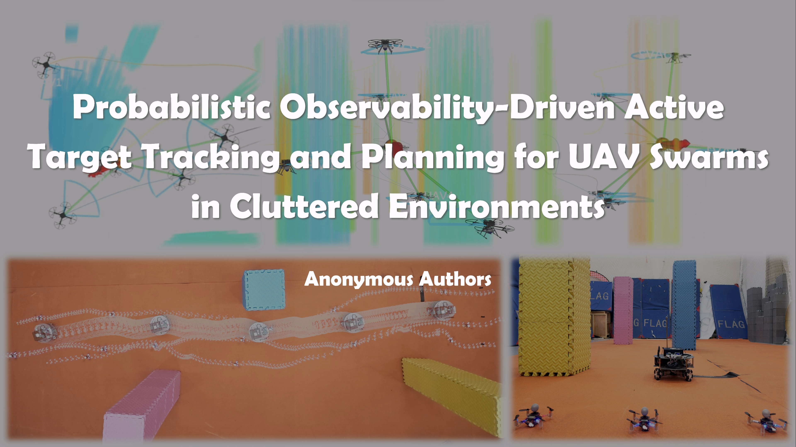
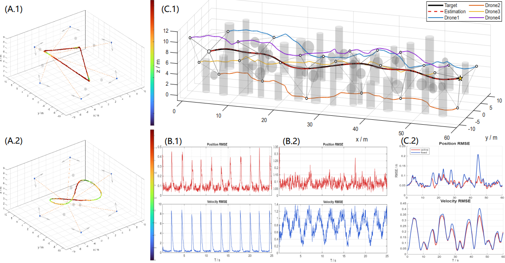

<div align="center">

# Probabilistic Observability-Driven Active Target Tracking and Planning for UAV Swarms in Cluttered Environments

Anonymous Authors
Submitted to IEEE International Conference on Robotics and Automation (ICRA 2027)
Under Review
<p align="center">
  
</p>

</div>

## Demo Video

<p align="center">
  <a href="video/video.mp4">
    
  </a>
</p>

<p align="center">
  <b>▶ Click the image to watch the supplementary video</b>
</p>

## Source code
Matlab and ROS source code will be released after the paper is accepted.


## Abstract

Maintaining target visibility does not necessarily ensure sufficient observability in cooperative bearing-only tracking, especially under intermittent occlusion and degraded observation geometry. 

This work presents a distributed active tracking framework integrating **effective-observation-aware DRLS-based estimation**, **probabilistic observability-driven active sensing configuration**, and **motion-primitive trajectory planning**.

Future joint information is predicted from shared target-motion scenarios, and the sensing configuration is optimized to maximize information utility subject to a prescribed probability bound on sufficient information along the weakest state direction. The optimized viewpoints are then realized by safe and dynamically feasible multi-UAV trajectories.

Extensive numerical simulations, high-fidelity ROS simulations, and real-world flight experiments demonstrate improved tracking accuracy, stronger weakest-direction information, and enhanced robustness to occlusion and observation-geometry degradation.

## System Overview

<p align="center">
  
</p>
<div align="center">

**Estimation → Active Sensing Configuration → Motion Planning**

</div>

## Experiments

The evaluation includes:
- Numerical validation of the distributed bearing-only estimator and 100 paired Active/Fixed numerical trials;
- 40 paired high-fidelity ROS simulations with **2–6 UAVs** in cluttered environments;
- Real-world flights with three quadrotors tracking a moving ground target.

<p align="center">
  
</p>

<p align="center">
  
</p>

<p align="center">
  
</p>

### Key Results


## Citation
If you find this work useful, please consider citing the paper. 
The final BibTeX entry will be updated after publication.

```bibtex
@inproceedings{probabilistic_observability_uav_tracking,
  title     = {Probabilistic Observability-Driven Active Target Tracking and Planning for UAV Swarms in Cluttered Environments},
  author    = {Anonymous Authors},
  booktitle = {Proceedings of the IEEE International Conference on Robotics and Automation(Under Review)},
  year      = {2027}
}
```
