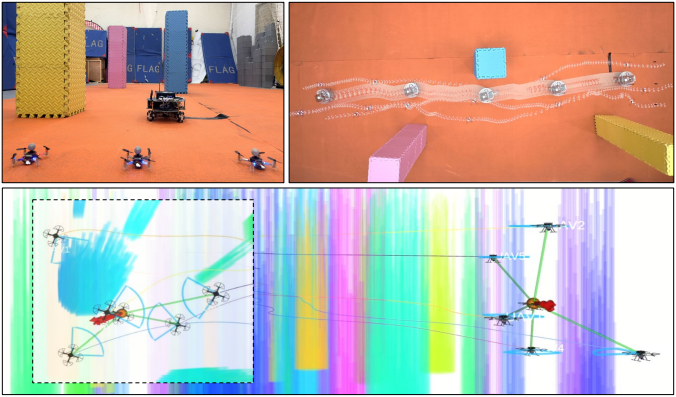
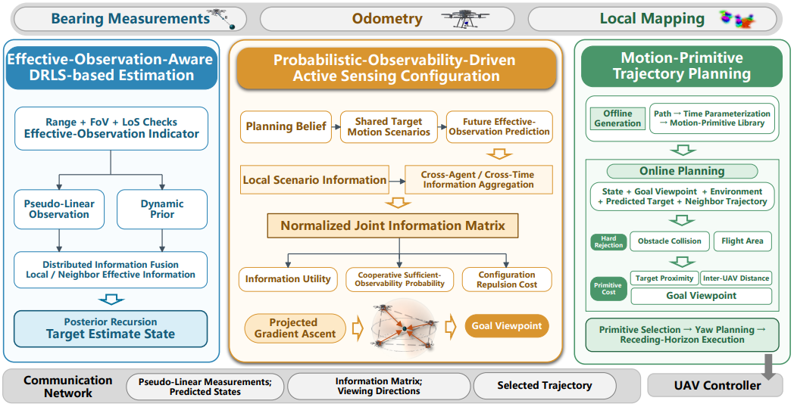
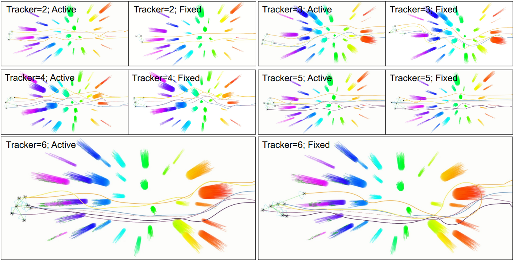
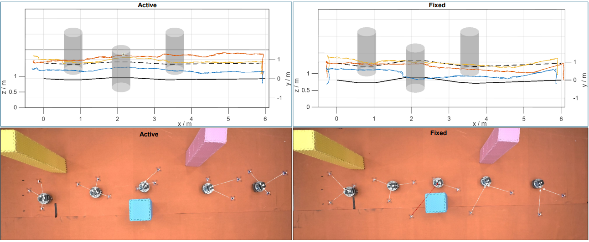

<div align="center">

# Probabilistic Observability-Driven Active Target Tracking and Planning for UAV Swarms in Cluttered Environments

Submitted to IEEE International Conference on Robotics and Automation (ICRA 2027), under review.

<p align="center">
  
</p>

</div>


## Abstract

Maintaining target visibility does not necessarily ensure sufficient observability in cooperative bearing-only tracking, especially under intermittent occlusion and degraded observation geometry. This work presents a distributed active tracking framework integrating **effective-observation-aware DRLS-based estimation**, **probabilistic observability-driven active sensing configuration**, and **motion-primitive trajectory planning**.

Future joint information is predicted from shared target-motion scenarios, and the sensing configuration is optimized to maximize information utility subject to a prescribed probability bound on sufficient information along the weakest state direction. The optimized viewpoints are then realized by safe and dynamically feasible multi-UAV trajectories.

Extensive numerical simulations, high-fidelity ROS simulations, and real-world flight experiments demonstrate improved tracking accuracy, stronger weakest-direction information, and enhanced robustness to occlusion and observation-geometry degradation.


## Method at a Glance

```text
Bearing Measurements        Odometry        Local Environment
        │                       │                    │
        ▼                       ▼                    ▼
┌─────────────────┐   ┌──────────────────────┐   ┌────────────────────┐
│ DRLS Estimation │ → │ Active Configuration │ → │ Motion-Primitive   │
│                 │   │                      │   │ Trajectory Planning│
└─────────────────┘   └──────────────────────┘   └────────────────────┘
        │                       │                    │
        └──────────── Distributed communication ─────┘
```

The central optimization maximizes overall information utility while enforcing a probabilistic lower bound on sufficient weakest-direction information.


## System Overview

<p align="center">
  
</p>

<div align="center">

**Estimation → Active Sensing Configuration → Motion Planning**

</div>

Our framework integrates effective-observation-aware DRLS-based estimation,
probabilistic observability-driven active sensing configuration, and
motion-primitive trajectory planning in a distributed closed loop.

The framework consists of three tightly coupled components:

- **Effective-observation-aware DRLS estimation** filters measurements using range, FoV, and LoS conditions and performs distributed information fusion.
- **Probabilistic-observability-driven sensing configuration** propagates shared target-motion scenarios, predicts future joint information, and actively organizes target-relative viewpoints.
- **Motion-primitive trajectory planning** realizes the optimized viewpoints through safe, dynamically feasible, receding-horizon multi-UAV motion.


## Representative Experiments

The evaluation includes:

- numerical validation of the distributed bearing-only estimator;
- 100 paired Active/Fixed numerical trials;
- high-fidelity ROS simulations with **2–6 UAVs** in cluttered environments;
- real-world flights with three quadrotors tracking a moving ground target.


<p align="center">
  
</p>

<p align="center">
  
</p>

### Key Results

| Metric | Result |
|---|---:|
| Mean position RMSE | **↓ 14.6%** |
| P95 position RMSE | **↓ 27.8%** |
| Mean minimum eigenvalue | **↑ 82.1%** |
| Effective-observation rate | **86.89% → 95.01%** |
| ROS team sizes | **2–6 UAVs** |
| Real-world validation | **3 UAVs** |


## Video

<div align="center">

### ▶️ [Watch the supplementary video](video/video.mp4)

</div>

The video presents the full pipeline from distributed bearing-only estimation to probabilistic active sensing configuration and trajectory execution, together with numerical, ROS, and real-world experiments.


## Citation

If you find this work useful, please consider citing the paper. 
The final BibTeX entry can be updated after publication.

```bibtex
@inproceedings{probabilistic_observability_uav_tracking,
  title     = {Probabilistic Observability-Driven Active Target Tracking and Planning for UAV Swarms in Cluttered Environments},
  author    = {Anonymous Authors},
  booktitle = {Proceedings of the IEEE International Conference on Robotics and Automation(Under Review)},
  year      = {2027}
}
```


## Acknowledgment

This repository accompanies the paper **“Probabilistic Observability-Driven Active Target Tracking and Planning for UAV Swarms in Cluttered Environments.”**
